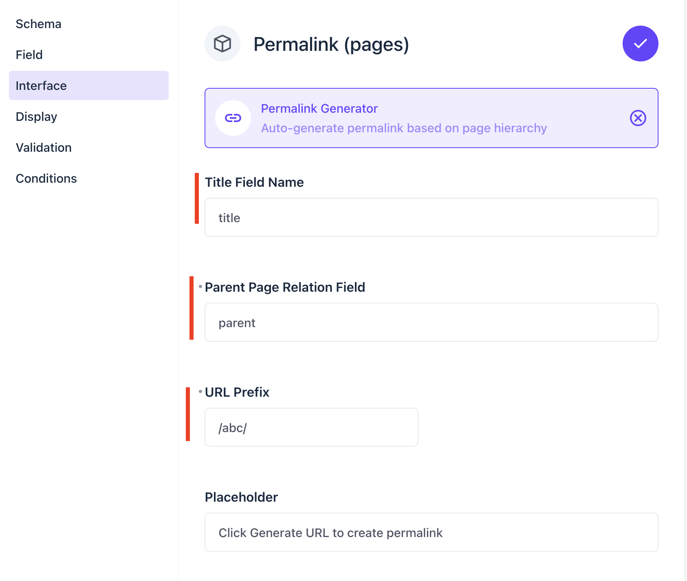
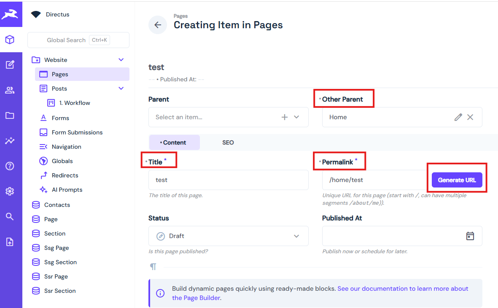

# Directus CMS Permalink Generator Extension

[](https://www.npmjs.com/package/directus-extension-permalink-generator)
[](https://www.npmjs.com/package/directus-extension-permalink-generator)
[](https://opensource.org/licenses/MIT)

**Auto-generate hierarchical permalinks for pages in Directus based on parent-child relationships.**

## Installation
This extension supports [Directus 11.x](https://directus.io/). In the root of your Directus server project run:

`$ npm i directus-extension-permalink-generator`

... and then restart Directus!


#### Note: If you are running Directus on docker, you need to install the extension in the directory **extensions** of the Directus server. Reference here for docker-compose file:
[https://github.com/letrthang/directus-app/blob/master/docker-compose.yml](https://github.com/letrthang/directus-app/blob/master/docker-compose.yml). 

Or simply run:

`$ npm i directus-extension-permalink-generator`

and then copy directory from:

`node_modules/directus-extension-permalink-generator` 

to `extensions/directus-extension-permalink-generator` and restart Directus docker.


## Prerequisites

- Directus 11.x
- Node.js 18+
- npm or yarn
- Install CMS template into Directus if it hasn't installed. 
Below is example of installation CMS template on Directus Docker console (`npx directus-template-cli@latest apply`)


## Development

### Step 1: Configure Pages Collection

Add a parent-child relationship to your Pages collection:

1. Open Directus Admin Panel
2. Navigate to **Settings** → **Data Model** → **Pages**
3. Click **Create Field**
4. Field name: `parent`
5. Field type: **Many to One Relationship**
6. Related collection: **Pages** (self-referential)
7. Save the field

#### => Repeating above steps to create other parent field with name is 'other_parent'. You can create many parent fields as you want.

This enables hierarchical page structures where pages can have parent pages.


### Step 2: Build the Extension

Clone and build the extension locally:

```bash
# Clone the repository
git clone https://github.com/letrthang/directus-cms-permalink-generator
cd directus-cms-permalink-generator

# Install dependencies
npm install

# Build the extension
npm run build
```

The built extension will be in the `dist/` folder.

### Step 3: Deploy to Directus

Copy the extension to your Directus installation:

**For Local Docker installations:**

Assuming you already have docker-compose installation for Directus. 
If not, here is a reference of docker-compose: `https://github.com/letrthang/directus-app`


```bash
# Copy to your mounted extensions directory
cp -r dist ./extensions/directus-extension-permalink-generator/
cp package.json ./extensions/directus-extension-permalink-generator/

# Restart Docker Directus
docker-compose restart
```

### Step 4: Configure the Permalink Field

1. Go to **Settings** → **Data Model** → **Pages**
2. Click on the **permalink** field
3. Under **Interface**, select **Permalink Generator**
4. Input **Title** field,  **Parent**,  **URL prefix**, **Placeholder** page which are existing in the data model/schema
5. Save changes



## Usage

When creating or editing a page:

1. Enter the page **Title** which you configured at the Permalink interface
2. Optionally select a **Parent** page which you configured at the Permalink interface.  **Note: a page cannot set parent is itself**
3. Click the **Generate URL** button next to the permalink field
4. The permalink will be automatically generated based on the hierarchy

#### Note: 

- Depending on value of the filed **URL prefix**, final URL will be appended from this field. 
- If you don't want to use the url from the **parent** page. Click on the clear (**x**) button of the Parent page's combo-box to remove the current selection before re-generating new URL.

### Examples

**Single-level page:**
- Title: "About Us"
- Parent: None
- Generated: `/about-us`

**Two-level page:**
- Title: "Our Team"
- Parent: "About Us"
- Generated: `/about-us/our-team`

**Three-level page:**
- Title: "Management"
- Parent: "Our Team" (which has parent "About Us")
- Generated: `/about-us/our-team/management`




## Features

- Automatic slug generation from page titles
- Hierarchical URL structure based on parent relationships
- URL-safe character conversion (spaces to hyphens, remove special chars)
- Success/error notifications
- Works with both new and existing pages
- Real-time generation with loading state

## Development

Run in development mode with hot reload:

```bash
npm run dev
```

### Debugging

Enable debug logging in browser console (F12):

1. Open browser DevTools
2. Go to Console tab
3. Click "Generate URL" button
4. View detailed logs showing the generation process

## Troubleshooting

**Extension not appearing:**
- Verify the extension folder is named `directus-extension-permalink-generator`
- Check Directus logs: `docker-compose logs -f directus`
- Ensure `package.json` has `"host": "^11.0.0"`
- Extension must be in `extensions/` directory (not `extensions/interfaces/`)

**Generate button not working:**
- Check browser console (F12) for errors
- Ensure the `parent` field exists in the Pages collection
- Verify API permissions allow reading page data
- Make sure you've entered a page title first

**Empty title error:**
- The extension requires a page title to generate the permalink
- Enter a title in the Title field before clicking Generate URL

## Technical Details

### Extension Structure

```
directus-extension-permalink-generator/
├── dist/
│   └── index.js          # Built extension
├── src/
│   ├── index.ts          # Extension definition
│   └── interface.vue     # Vue component
├── package.json
└── README.md
```

### How It Works

1. User clicks "Generate URL" button
2. Extension fetches current page data (title, parent) and validation existing of configured fields.
3. Recursively builds path by following parent relationships
4. Converts each title to URL-safe slug
5. Combines path segments with forward slashes
6. Updates permalink field with generated URL

## License

MIT
